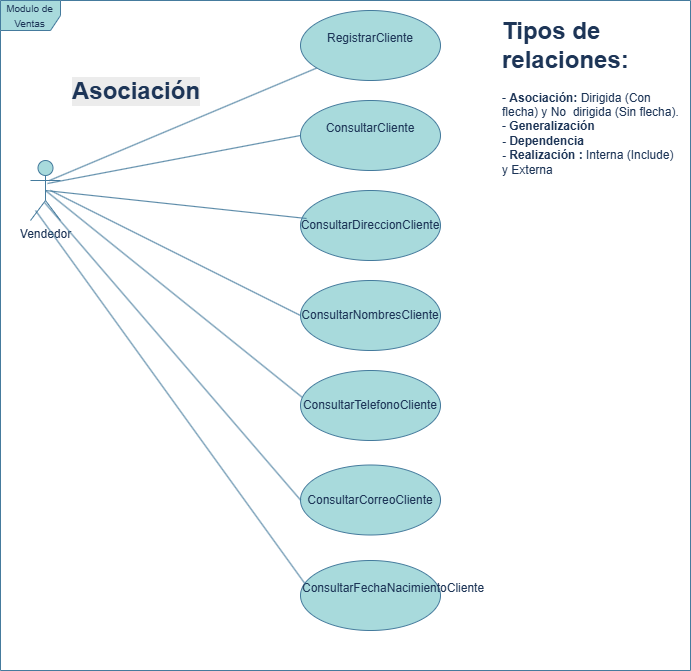

> [!NOTE]
> ## CLASE 1
> ## 15/04/2025

# Índice

- [Ir a PROCESO UNIFICADO DE DESARROLLO](#proceso-unificado-de-desarrollo)
- [Ir a Información de la Carrera](#información-de-la-carrera)
- [Ir a Diagrama de Modulos](#diagrama-de-modulos)
- [Ir a Casos de Uso](#casos-de-uso)
- [Ir a Perfil Profesional](#perfil-profesional)

> [!NOTE]
> ## PROCESO UNIFICADO DE DESARROLLO
> - *PUD* Asi empezo el sw (primer estandar de desarrollo), METODO GENERAL  
> metodologia pesada (tradicional) asi se le llama al proceso unificado de desarrollo.                             RUP (Rational Unified Process)  
> fases: inception, elaboration, construction, transition (cada fase se puede dividir en iteraciones que resulta en un mini proyecto - producto incremental)  
> en cada fase se debe realizar todo el workflow y pasar por todo:  
> flujos de trabajos (workflows): modelamiento del negocio, requerimientos, analisis y diseño, implementacio, deployment,   

> [!NOTE]
> Inception: se hace el documento SRS 804  
> Elaboration: aqui se hacen los casos de uso y se analizan con diagramas de robustez   
> Diagrama de casos de uso != caso de uso

en la fase de analisis no se habla del lenguaje de programacion

> [!TIP]
> ## Diagrama de Modulos 
>  🧩 Diagrama de Paquetes del Sistema ERP  
> El siguiente diagrama representa los módulos del sistema ERP y sus dependencias principales:  
>   

> [!TIP]
> ## Casos de uso
> *Son una descripción (Sin mucho detalle) del sistema.*  
> ## 1. Diagramas de casos de uso
> **Ejemplo**  
>   
> *Un caso de uso puede tener N escenearios.*  
> **Escenario Básico:** *(Solo 1) Acciones que llevan al éxito del caso de uso.*   
> **Escenario alternativo:** (1 o más) Secuencias de acciones que llevan al éxito o NO del caso uso*  

> [!IMPORTANT]
> En pud existen 4 fases y podemos dividir en slice, para pasar a la siguiente fase debo de pasar por todo el proceso.
> <strong>Pilares del PUD:</strong>
> <ul>
> <li>Dirigido por casos de usos
> 
Por cada requisito hay un caso de uso que guian todo el proceso de desarrollo de software.
</li> 
> <li>Centrado en la arquitectura</li>
> <li>Incremental e iterativo</li> </ul>

1* Esto sucede en el Inception (levantamiento inicial de requisitos)

Como hago los requerimientos

SRS 830

https://www.studocu.com/es-ar/document/universidad-nacional-del-centro-de-la-provincia-de-buenos-aires/metodologias-de-desarrollo-de-software-i/proceso-unificado/12101649

2* Requisitos: UML (Lenguaje de modelado que le acompaña al PUD)
En la parte de requisitos que meto en UML?

Diagrama de casos de usos

Include: 

Exclude: 

Los ovalos representan una accion que quiere hacer el usuario con el sistema que otorga valor (funcionalidad concreta)

No sigue una secuencia de ejecucion

Una vez que tengo los casos de uso debo explicar el problema desde el punto de vista de UML y para esto: 

Yo explico el problema en contexto de ingeniería con un diagrama de clases.

Describir el problema dentro del proceso unificado se llama <strong>Modelo del dominio</strong>

Diagrama de clases

3. a partir de los casos de uso yo puedo imaginarme un posible <strong>modelo de navegación</strong> que tendra el sistema.
   Emulo cuales serian las interfaces de usuario
   para esto utilizo la maquina de estados (diagrama UML)
   Estado: Login
  **QUE ES GUARDA** 

**AQUI SE TERMINAN LOS REQUISITOS-**
**ANALISIS**
dirigido por casos de uso: con un caso de uso hago el analisis, diseño, implementacion.
En el analisis yo cojo un caso de uso y lo analizo -> Modelo de analisis 
y para representar en UML utilizo robustez (para cada caso de uno un diagrama de robustez)

**CENTRADO EN LA ARQUITECTURA**
-En el momento que analizo ya debo de tener una idea de la arquitectura que va a tener el sistema. (MVC ModeloVistaControlador)
Cuando hago el diagrama de robustez ya empiezo a centrar al caso de uso en la arquitectura
-  
